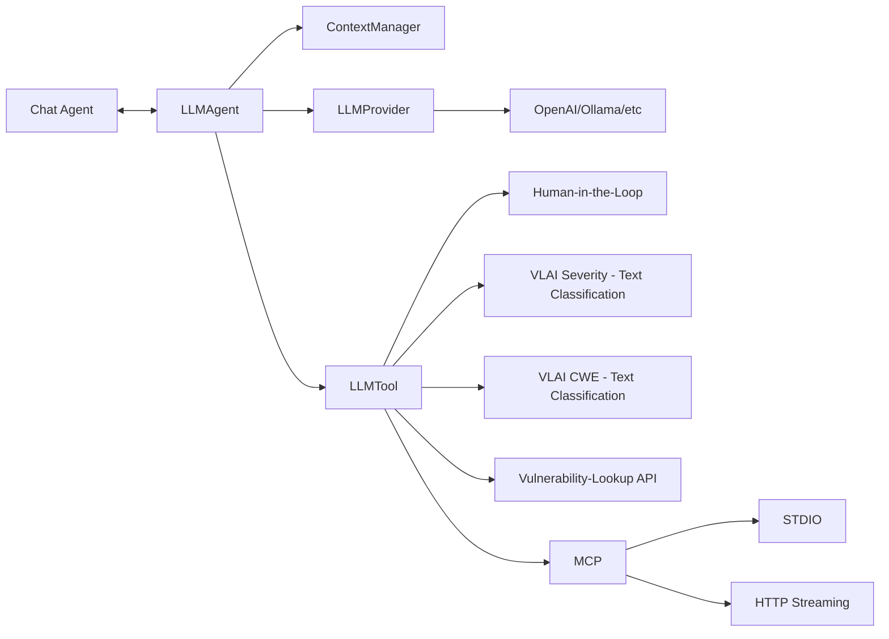

# VulnAgent

VulnAgent is an experimental AI-assisted cybersecurity agent framework that orchestrates modular agents using LLMs and domain-specific tools, communicating over XMPP.
It combines reasoning with custom vulnerability tooling (e.g., severity and CWE classification, Vulnerability-Lookup API) to automate tasks such as vulnerability classification and interaction with security workflows.

While the concept of AI agents—models coupled with tools and orchestration logic—has become fairly standardized, VulnAgent explores a distinctive approach tailored to cybersecurity.
Its agents communicate over XMPP, leveraging native support for asynchronous messaging, concurrent behaviours, presence, and discovery, making it well suited for distributed, agentic security workflows.


## Features

- Modular AI agents combining reasoning (LLM) and tools
- Tool orchestration with clear mental models
- XMPP-based communication between agents
- Integration with the Vulnerability-Lookup API and custom classifiers (e.g., CWE and severity classification)


## Architecture



Human-in-the-loop is still in work and will be probably linked to the Vulnerability-Lookup API tool.  
The LLM provider can be configured in ``vulnagent.agent.llm:get_llm_provider()``. The default is ``qwen2.5:7b``.


**Component Overview:**


| Component          | Description                                                                        |
| ------------------ | ---------------------------------------------------------------------------------- |
| **ChatAgent**      | Entry point optionnaly with guardrails filtering.                                  |
| **LLMAgent**       | Core agent that reasons using a language model.                                    |
| **ContextManager** | Tracks conversation state and memory.                                              |
| **LLMProvider**    | Connects to models (OpenAI, Ollama, Qwen, etc.).                                   |
| **LLMTool**        | Performs actions such as classification, API queries, or human-in-the-loop checks. |
| **MCP**            | Multi-channel publisher for STDIO or HTTP streaming outputs.                       |

The **LLMAgent** (Qwen) leverages the
[VLAI Severity classification](https://huggingface.co/CIRCL/vulnerability-severity-classification-roberta-base) and
[VLAI CWE classification](https://huggingface.co/CIRCL/cwe-parent-vulnerability-classification-roberta-base) models as integrated tools, enabling automated vulnerability severity assessment and CWE categorization within its reasoning workflow.


## Agent Principle

```text
VulnAgent
 ├── Reasoning (LLM via spade-llm, Ollama or API)
 ├── Tools
 │    ├── SeverityClassifierTool (RoBERTa)
 │    ├── CVSS normalizer tool (planned)
 │    └── Other extensible tools
 └── Actions / Messages
 ```

```text
You: "What is the severity of the vulnerability described ..."
LLM: "This looks like a vulnerability description.
      I should classify severity."
→ calls severity_classifier tool
→ receives result
→ explains or forwards
```

Tools are assigned to an (LLM) agent. An agent can use one or multiple tools and should clearly explain their functionality.
Communications via XMPP/FIPA.


## Test


Install Ollama

```bash
curl -fsSL https://ollama.ai/install.sh | sh
ollama pull llama3.1:8b
ollama pull qwen2.5:7b
ollama serve
```

```bash
# Check if default ports are already in use
netstat -an | grep 5222

# Try different ports if needed, or shutdown prosodyctl
spade run --client_port 6222 --server_port 6269
```

then use the Web interface to create the agent's password.


Alternatively (maybe even better, and it's what had been tested so far), use Prosody. In this
case create the agent's password:

```bash
$ sudo prosodyctl adduser tool_assistant@localhost
$ sudo prosodyctl adduser user@localhost
$ sudo prosodyctl adduser coordinator@localhost
```

```bash
$ cd VulnAgent/
$ poetry install
$ poetry shell
$ vulnagent
Device set to use cpu
XMPP server domain (default: localhost): 
LLM agent password: 
Chat agent password: 
✅ Agents started!
🔧 Available tools:
• classify_severity
• classify_cwe
...
...
```

Agents be registered to the registry and presence notification system.


