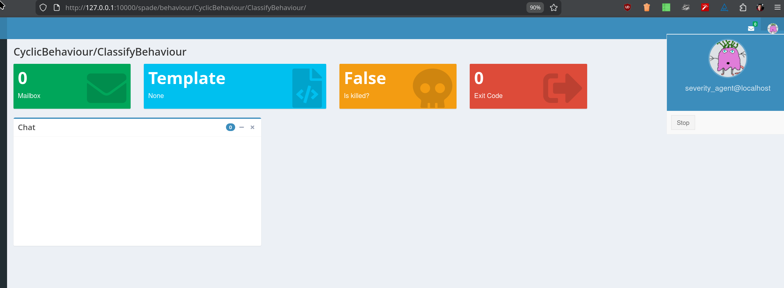

# VLAgentIc

VLAI is Agentic!


## Principle

VLAgentIcAgent
 ├── Reasoning (LLM via spade-llm, Ollama or API)
 ├── Tools
 │    └── SeverityClassifierTool (RoBERTa)
 |    └── CVSS normalizer tool (not yet implemented)
 └── Actions / messages


You: "What is the severity of the vulnerability described ..."
LLM: "This looks like a vulnerability description.
      I should classify severity."
→ calls severity_classifier tool
→ receives result
→ explains or forwards

Tools are assigned to an agent. An agent can use one or multiple tools and should clearly explain their functionality.
Communications via XMPP/FIPA.

**Mental model:**

Message →
  LLM decides: classify / respond →
    Tool call →
      LLM explains →
        Reply


Agent receives vulnerability description
↓
Agent decides: "I should classify severity"
↓
Calls VLAI classifier tool
↓
Receives severity + confidence
↓
Agent responds / logs / forwards


## Test


Install Ollama

```bash
curl -fsSL https://ollama.ai/install.sh | sh
ollama pull llama3.1:8b
ollama pull qwen2.5:7b
ollama serve
```

```bash
# Check if default ports are already in use
netstat -an | grep 5222

# Try different ports if needed, or shutdown prosodyctl
spade run --client_port 6222 --server_port 6269
```

then use the Web interface to create the agent's password.


Alternatively (maybe even better), use Prosody. In this
case create the agent's password:

```bash
$ sudo prosodyctl adduser severity_agent@localhost
Password: password
```

```bash
# python agent.py

scripts/run_expert.py
```

It will be registered to the registry and presence notification system.

Monitor incoming messages:




