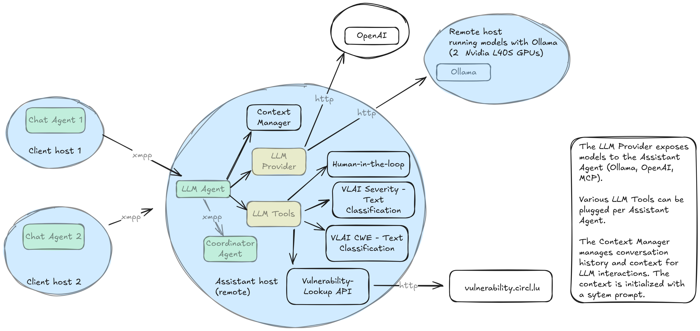
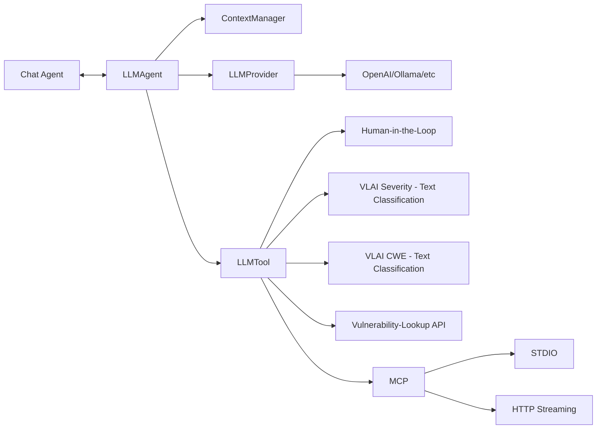

# VulnAgent


VulnAgent is an experimental AI-assisted cybersecurity agent framework that orchestrates modular agents using LLMs and domain-specific tools, communicating over XMPP.
It combines reasoning with custom vulnerability tooling (e.g., severity and CWE classification, Vulnerability-Lookup API) to automate tasks such as vulnerability classification and interaction with security workflows.

While the concept of AI agents—models coupled with tools and orchestration logic—has become fairly standardized, VulnAgent explores a distinctive approach tailored to cybersecurity.
Its agents communicate over XMPP, leveraging native support for asynchronous messaging, concurrent behaviours, presence, and discovery, making it well suited for distributed, agentic security workflows.


## Features

- Modular AI agents combining reasoning (LLM) and tools
- Tool orchestration with clear mental models
- XMPP-based communication between agents
- Integration with the Vulnerability-Lookup API and custom classifiers (e.g., CWE and severity classification)


## Architecture





**Inter-agent communication**


```mermaid
graph LR
    Ch[Chat Agent] <--> A[LLMAgent]
    A --> C[ContextManager]
    A --> D[LLMProvider]
    A --> E[LLMTool]
    D --> F[OpenAI/Ollama/etc]
    E --> I[Human-in-the-Loop]
    E --> T1[VLAI Severity - Text Classification]
    E --> T2[VLAI CWE - Text Classification]
    E --> T3[Vulnerability-Lookup API]
    E --> J[MCP]
    J --> K[STDIO]
    J --> L[HTTP Streaming]
```

Human-in-the-loop is still in work and will be probably linked to the Vulnerability-Lookup API tool.  
The LLM provider can be configured in ``vulnagent.agent.llm:get_llm_provider()``. The default is ``qwen2.5:7b``.


**Component Overview:**


| Component          | Description                                                                        |
| ------------------ | ---------------------------------------------------------------------------------- |
| **ChatAgent**      | Entry point optionnaly with guardrails filtering.                                  |
| **LLMAgent**       | Core agent that reasons using a language model.                                    |
| **ContextManager** | Tracks conversation state and memory.                                              |
| **LLMProvider**    | Connects to models (OpenAI, Ollama, Qwen, etc.).                                   |
| **LLMTool**        | Performs actions such as classification, API queries, or human-in-the-loop checks. |
| **MCP**            | Multi-channel publisher for STDIO or HTTP streaming outputs.                       |

The **LLMAgent** (Qwen) leverages the
[VLAI Severity classification](https://huggingface.co/CIRCL/vulnerability-severity-classification-roberta-base),
[VLAI Severity classification (Chinese)](https://huggingface.co/CIRCL/vulnerability-severity-classification-chinese-macbert-base), and
[VLAI CWE classification](https://huggingface.co/CIRCL/cwe-parent-vulnerability-classification-roberta-base) models as integrated tools, enabling automated vulnerability severity assessment and CWE categorization within its reasoning workflow.


## Agent Principle

```text
VulnAgent
 ├── Reasoning (LLM via spade-llm, Ollama or API)
 ├── Tools
 │    ├── SeverityClassifierTool (RoBERTa)
 │    ├── SeverityClassifierTool Chinese (MacBERT)
 │    ├── CVSS normalizer tool (planned)
 │    └── Other extensible tools
 └── Actions / Messages
 ```

```text
You: "What is the severity of the vulnerability described ..."
LLM: "This looks like a vulnerability description.
      I should classify severity."
→ calls severity_classifier tool
→ receives result
→ explains or forwards
```

Tools are assigned to an (LLM) agent. An agent can use one or multiple tools and should clearly explain their functionality.
Communications via XMPP/FIPA.


## Test


### Install Ollama

```bash
curl -fsSL https://ollama.ai/install.sh | sh
ollama pull llama3.1:8b
ollama pull qwen2.5:7b
ollama serve
```

```bash
# Check if default ports are already in use
netstat -an | grep 5222

# Try different ports if needed, or shutdown prosodyctl
spade run --client_port 6222 --server_port 6269
```

then use the Web interface to create the agent's password.


Alternatively (maybe even better, and it's what had been tested so far), use Prosody. In this
case create the agent's password:

```bash
$ sudo prosodyctl adduser tool_assistant@localhost
$ sudo prosodyctl adduser user@localhost
$ sudo prosodyctl adduser coordinator@localhost
```


### Install the project

```bash
$ cd VulnAgent/
$ poetry install
$ poetry shell
```

### Launch the agents

```bash
$ vulnagent-llm
Device set to use cpu
XMPP server domain (default: localhost): 
LLM provider to use (default: qwen2.5:7b):   
Agent name (default: tool_assistant): 
LLM agent password: 
LLM Agent Web Interface: http://127.0.0.1:10000/spade
Press Ctrl+C to exit.
```

```bash
$ vulnagent-chat 
XMPP server domain (default: localhost): 
Agent name (default: chat_agent): 
Chat agent password: 
✅ Agent started!
🔧 Available tools:
• classify_severity
• classify_severity_zh
• classify_cwe
• get_current_time
• calculate_math
• get_weather

💡 Try these queries:
• 'What's the severity of the vulnerability described by ...?'
• 'What time is it?'
• 'Calculate 15 * 8 + 32'
• 'What's the weather in Luxembourg?'

Chat session started. Type 'exit' to quit.

> What is the severity of a vulnerability described with: The Advanced Custom Fields: Extended plugin for WordPress is vulnerable to Privilege Escalation in all versions up to, and including, 0.9.2.1. This is due to the 'insert_user' function not restricting the roles with which a user can register. This makes it possible for unauthenticated attackers to supply the 'administrator' role during registration and gain administrator access to the site. Note: The vulnerability can only be exploited if 'role' is mapped to the custom field.    
╭──────────────────────────────────────────────────────────────────────────────────────── 🗨  tool_assistant@localhost/BFxpWUtCE0n3 ─────────────────────────────────────────────────────────────────────────────────────────╮
│ The severity of the described vulnerability is classified as Critical with a confidence of 58.26%. This indicates that the vulnerability poses a significant risk and should be addressed promptly to prevent             │
│ unauthorized access or privilege escalation.                                                                                                                                                                              │
╰───────────────────────────────────────────────────────────────────────────────────────────────────────────────────────────────────────────────────────────────────────────────────────────────────────────────────────────╯
> exit

Chat session ended.
```

Agents are registered to the registry and presence notification system.


## Configuration

VulnAgent uses a TOML configuration file to manage defaults for XMPP server, agent names, passwords, and LLM provider settings. All values have built-in defaults, so the configuration file is entirely optional.

The configuration file is loaded from (in order of priority):

1. The path specified by the `VULNAGENT_CONFIG` environment variable
2. `~/.config/vulnagent/config.toml` (follows XDG conventions)

If no configuration file is found, the built-in defaults are used.

Example `~/.config/vulnagent/config.toml`:

```toml
[xmpp]
server = "localhost"

[agents.llm]
name = "tool_assistant"
password = "password"

[agents.chat]
name = "chat_agent"
password = "password"

[agents.vlai]
name = "vlai_assistant"
password = "password"

[agents.coordinator]
name = "coordinator"
password = "password"

[llm]
provider = "qwen2.5:7b"
base_url = "http://localhost:11434/v1"
temperature = 0.7
```

You only need to include the values you want to override. For example, to change just the LLM provider and XMPP server:

```toml
[xmpp]
server = "xmpp.example.com"

[llm]
provider = "llama3.1:8b"
```

When a password is set in the configuration file, the interactive password prompt is skipped. To force a prompt, remove the password entry from the configuration file.


## License

[VulnAgent](https://github.com/vulnerability-lookup/VulnAgent) is free software released under the
[GNU General Public License version 3](https://www.gnu.org/licenses/gpl-3.0.html).

~~~
Copyright (c) 2025-2026 Computer Incident Response Center Luxembourg (CIRCL)
Copyright (c) 2025-2026 Cédric Bonhomme - https://github.com/cedricbonhomme
~~~
